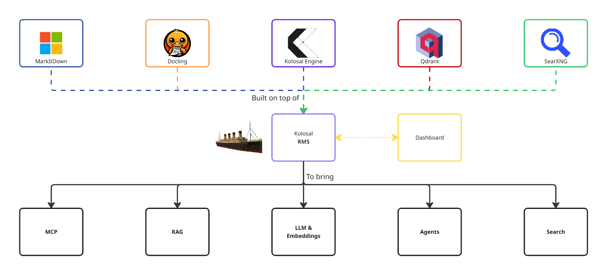
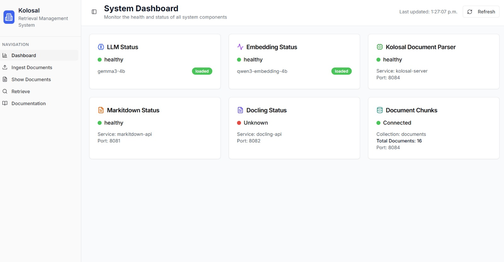

# Kolosal AI Retrieval Management System
⚡ All-in-one, fully-local LLM retrieval orchestration: parse, embed, search, deploy, done.

<div align="center">
  
</div>


## Overview
Kolosal AI Retrieval Management System is an integrated, all-in-one solution combining a powerful LLM inference engine, embedding engine, robust document parser, high-performance vector database, built-in internet search capability, and a centralized management dashboard to seamlessly orchestrate all components. This unified platform fulfills over 90% of your LLM integration requirements while ensuring complete local deployment, privacy, and data control.



## Features

- MCP (Model Context Protocol)

- RAG (Retrieval-Augmented Generation)

- LLM & Embeddings Inference

- AI Agents

- Internet Search

- Dashboard


## Built On Top Of

This system integrates the following components:

- **[Kolosal AI Inference Engine](https://github.com/KolosalAI/kolosal-server)** - LLM inference server (docker branch)
- **[Kolosal RMS Dashboard](https://github.com/KolosalAI/Kolosal-RMS-Dashboard)** - Web-based management interface
- **[Kolosal RMS MarkItDown](https://github.com/KolosalAI/Kolosal-RMS-MarkItDown)** - Document parsing service
- **[Qdrant Vector Database](https://github.com/qdrant/qdrant)** - High-performance vector database
- **[SearXNG Docker](https://github.com/searxng/searxng-docker)** - Privacy-respecting search engine

## Getting Started

### Quick Docker Setup (Recommended)

The easiest way to get started - just 2 commands:

```bash
# 1. Clone this repository
git clone https://github.com/KolosalAI/Retrieval-Management-System.git
cd Retrieval-Management-System

# 2. Start all services
docker-compose up -d
```

All services will be automatically built from their respective GitHub repositories. No setup scripts or submodules needed!

#### Access Services:
- **Dashboard**: http://localhost:3000
- **Kolosal Server (AI Inference)**: http://localhost:8084
- **Qdrant Vector DB**: http://localhost:6333
- **SearXNG Search**: http://localhost:8090
- **MarkItDown API**: http://localhost:8001

For detailed Docker setup instructions, see [DOCKER_SETUP.md](DOCKER_SETUP.md).

## Configuration

## Contributing


## License
This project is licensed under the Apache 2.0 License - see the [LICENSE](LICENSE) file for details.