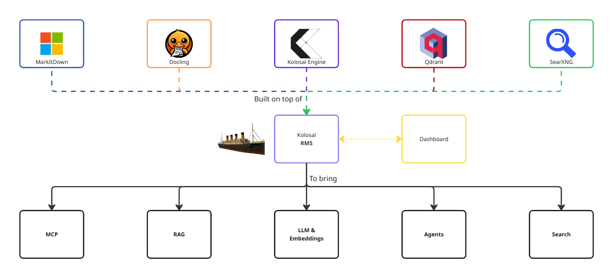
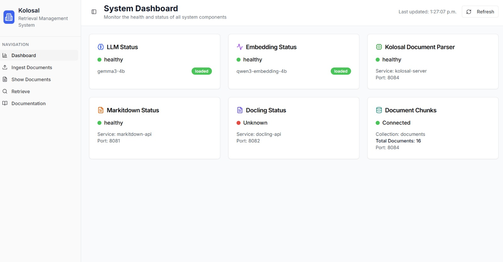

# Kolosal AI Retrieval Management System
⚡ All-in-one, fully-local LLM retrieval orchestration: parse, embed, search, deploy, done.

  

## Overview
Kolosal AI Retrieval Management System is an integrated, all-in-one solution combining a powerful LLM inference engine, embedding engine, robust document parser, high-performance vector database, built-in internet search capability, and a centralized management dashboard to seamlessly orchestrate all components. This unified platform fulfills over 90% of your LLM integration requirements while ensuring complete local deployment, privacy, and data control.

## Features

- MCP (Model Context Protocol)

- RAG (Retrieval-Augmented Generation)

- LLM & Embeddings Inference

- AI Agents

- Internet Search

- Dashboard

## Built On Top Of

- [Kolosal AI Inference Engine](https://github.com/KolosalAI/kolosal-server)

- [Qdrant Vector Database](https://github.com/qdrant/qdrant)

- [SearXNG Internet Search](https://github.com/searxng/searxng)

- [MarkItDown](https://github.com/microsoft/markitdown)

- [Docling](https://github.com/DS4SD/docling)

## Getting Started

## Contributing

## License
This project is licensed under the Apache 2.0 License - see the [LICENSE](LICENSE) file for details.