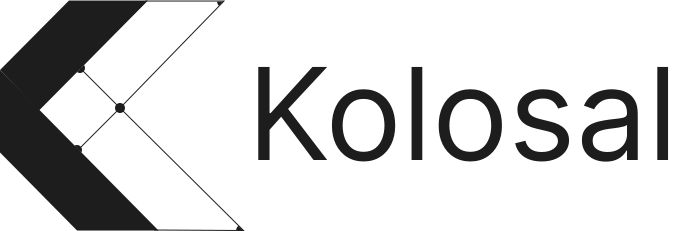
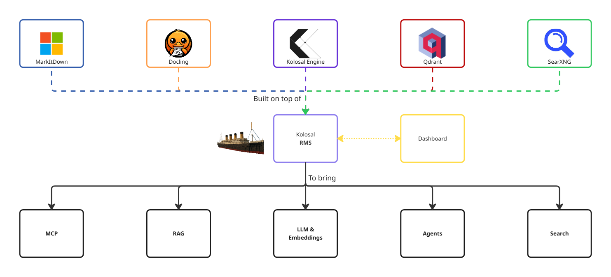
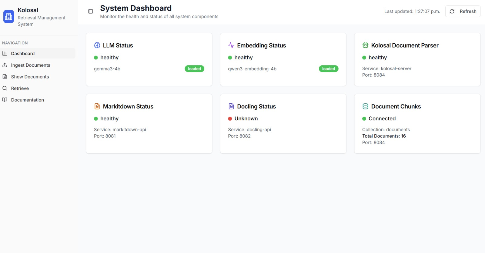

# Kolosal Retrieval Management System

⚡ All-in-one, fully-local LLM retrieval orchestration: parse, embed, search, deploy, done.

<div align="center">
  
</div>


## Overview

Kolosal Retrieval Management System is an integrated, all-in-one solution combining a powerful LLM inference engine, embedding engine, robust document parser, high-performance vector database, built-in internet search capability, and a centralized management dashboard to seamlessly orchestrate all components. This unified platform fulfills over 90% of your LLM integration requirements while ensuring complete local deployment, privacy, and data control.



## Helm Kubernetes

This Helm chart deploys the Kolosal Retrieval Management System on Kubernetes with GPU support.

## Features

- MCP (Model Context Protocol)

- RAG (Retrieval-Augmented Generation)

- LLM & Embeddings Inference

- AI Agents

- Internet Search

- Dashboard


## Built On Top Of

This system integrates the following components:

- **[Kolosal Inference Engine](https://github.com/KolosalAI/kolosal-server)** - LLM inference server (prebuilt image)
- **[Kolosal RMS Dashboard](https://github.com/KolosalAI/Kolosal-RMS-Dashboard)** - Web-based management interface (prebuilt image)
- **[Kolosal RMS MarkItDown](https://github.com/KolosalAI/Kolosal-RMS-MarkItDown)** - Document parsing service (prebuilt image)
- **[Qdrant Vector Database](https://github.com/qdrant/qdrant)** - High-performance vector database
<!-- Internet search is optional and not included by default -->

## Helm Chart Structure

```
kolosal-platform/
├── Chart.yaml                    # Chart metadata
├── values.yaml                   # Default configuration values
├── values-production.yaml        # Example production values
├── .helmignore                   # Files to ignore when packaging
├── validate.sh                   # Validation script
├── README.md                     # Installation and usage guide
├── STRUCTURE.md                  # This file
└── templates/
    ├── NOTES.txt                # Post-installation notes
    ├── _helpers.tpl             # Reusable template helpers
    ├── secrets.yaml             # API keys and secrets
    ├── qdrant/                  # Qdrant vector database
    │   ├── deployment.yaml
    │   ├── service.yaml
    │   ├── pvc.yaml
    │   └── init-job.yaml        # Initialization job (Helm hook)
    ├── markitdown/              # MarkItDown service (optional)
    │   ├── deployment.yaml
    │   ├── service.yaml
    │   └── hpa.yaml            # Horizontal Pod Autoscaler
    ├── docling/                 # Docling service (optional)
    │   ├── deployment.yaml
    │   ├── service.yaml
    │   └── hpa.yaml
    ├── kolosal-server/          # Main AI inference engine
    │   ├── configmap.yaml       # Server configuration
    │   ├── deployment.yaml      # GPU-enabled deployment
    │   ├── service.yaml
    │   ├── pvc.yaml            # Model storage
    │   └── hpa.yaml            # GPU-aware autoscaling
    └── dashboard/               # Web dashboard
        ├── deployment.yaml
        └── service.yaml
```

## Getting Started

### Prerequisites

- Kubernetes 1.24+
- Helm 3.0+
- NVIDIA GPU Operator installed in the cluster
- Storage provisioner for PersistentVolumeClaims
- LoadBalancer support (optional, for external access)

### Quick Setup (Recommended)

The easiest way to get started - just 2 commands:

```bash
# 1. Clone this repository
git clone https://github.com/KolosalAI/Retrieval-Management-System.git
cd Retrieval-Management-System

# 2. Start all services

# Install with default values
helm install kolosal-platform ./kolosal-platform

# Install with custom values
helm install kolosal-platform ./kolosal-platform -f custom-values.yaml
```

Important: Setting External URL
The dashboard requires an external URL to connect to the API. Set this during installation:

```bash
helm install kolosal-platform ./kolosal-platform \
  --set global.externalUrl=http://YOUR-EXTERNAL-IP-OR-DOMAIN
```

## Configuration

### Enabling/Disabling Services

You can enable or disable individual services:

```yaml
# values.yaml
markitdown:
  enabled: true  # Set to false to disable

docling:
  enabled: true  # Set to false to disable

# Disable both:
helm install kolosal-platform ./kolosal-platform \
  --set markitdown.enabled=false \
  --set docling.enabled=false
```

### GPU Configuration

The kolosal-server requires NVIDIA GPUs. Configure GPU resources:

```yaml
kolosalServer:
  resources:
    requests:
      nvidia.com/gpu: 1  # Number of GPUs per pod
    limits:
      nvidia.com/gpu: 1
```

### API Authentication

Configure API keys for secure access:

```yaml
kolosalServer:
  config:
    auth:
      require_api_key: true

secrets:
  apiKeys:
    - name: production-key
      value: "your-secure-api-key-here"  # Generate a secure key
    - name: development-key
      value: "another-secure-key"
```

### Storage Configuration

Configure persistent storage:

```yaml
global:
  storageClass: "fast-ssd"  # Your storage class

qdrant:
  persistence:
    enabled: true
    size: 20Gi

kolosalServer:
  persistence:
    models:
      enabled: true
      size: 100Gi  # Adjust based on model sizes
```

### Autoscaling

Configure horizontal pod autoscaling:

```yaml
kolosalServer:
  autoscaling:
    enabled: true
    minReplicas: 1
    maxReplicas: 5
    metrics:
      - type: Resource
        resource:
          name: gpu
          target:
            type: Utilization
            averageUtilization: 80

markitdown:
  autoscaling:
    enabled: true
    minReplicas: 2
    maxReplicas: 10
    targetCPUUtilizationPercentage: 80
```

### Custom Model Configuration

Add or modify models:

```yaml
kolosalServer:
  config:
    models:
      - id: custom-embedding-model
        path: https://huggingface.co/your-model/resolve/main/model.gguf
        type: embedding
        load_immediately: true
        main_gpu_id: 0
        inference_engine: llama-vulkan
        load_params:
          n_ctx: 8192
          n_gpu_layers: -1  # Use all layers
```

## Common Operations

### Upgrade the Release

```bash
helm upgrade kolosal-platform ./kolosal-platform \
  -f custom-values.yaml
```

### Check Service Status

```bash
# Get all pods
kubectl get pods -l app.kubernetes.io/instance=kolosal-platform

# Get services
kubectl get svc -l app.kubernetes.io/instance=kolosal-platform

# Check HPA status
kubectl get hpa
```

### Access Logs

```bash
# Kolosal server logs
kubectl logs -l app.kubernetes.io/component=kolosal-server

# Qdrant logs
kubectl logs -l app.kubernetes.io/component=qdrant
```

### Port Forwarding (for testing)

```bash
# Forward kolosal-server
kubectl port-forward svc/kolosal-platform-kolosal-server 8080:8080

# Forward dashboard
kubectl port-forward svc/kolosal-platform-dashboard 3000:3000
```

### Values Reference

See `values.yaml` for all configurable parameters.

## Contributing

## License

This project is licensed under the Apache 2.0 License - see the [LICENSE](LICENSE) file for details.
